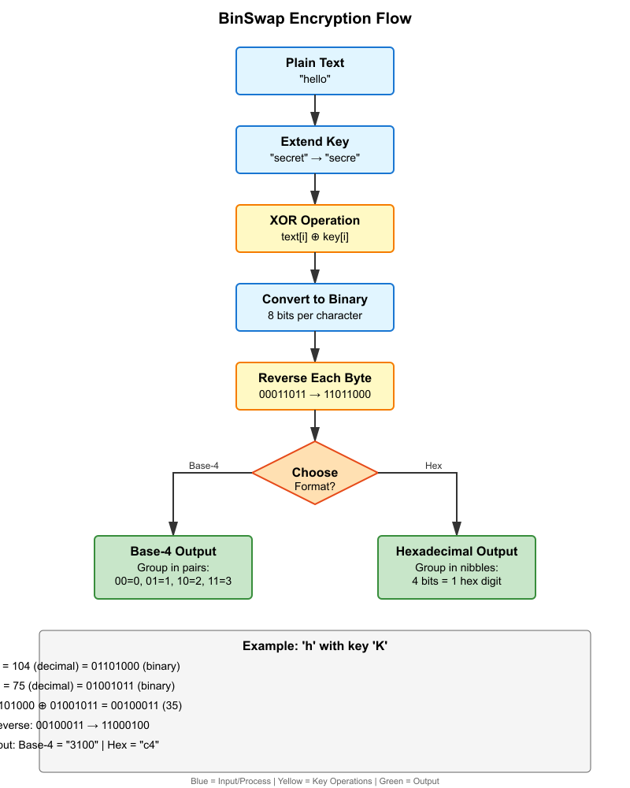

# BinSwap

A lightweight, key-based text encoder/decoder implementing XOR encryption with binary manipulation. Designed for personal, low-security encoding tasks.

## Features

- **Key-based encryption** using XOR cipher
- **Binary bit reversal** for additional obfuscation
- **Dual output formats**: Base-4 (Quaternary) and Hexadecimal
- **Text and file operations** with intuitive TUI
- **Cross-platform** Python implementation

## How It Works


### Encryption Process

1. **Extend Key**: Repeat encryption key to match input length
2. **XOR Operation**: Apply XOR cipher using extended key
3. **Binary Conversion**: Convert result to 8-bit binary
4. **Bit Reversal**: Reverse each byte for obfuscation
5. **Format Encoding**: Output as Base-4 or Hexadecimal

### Example

```
Input:  "hello"
Key:    "secret"
Output: "d8e0781450" (Hexadecimal)
```

## Requirements

Python 3.6 or higher (no external dependencies)

## Security Notice

**WARNING**: BinSwap is intended for personal, low-security use only. Not cryptographically secure.

## Technical Details

- **Algorithm**: XOR cipher with binary bit reversal
- **Output formats**: Base-4 (quaternary) and Hexadecimal

---

**Remember**: Always keep your encryption key safe. Without it, encoded data cannot be recovered.